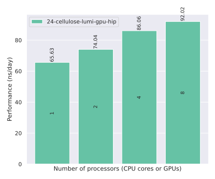
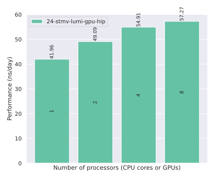

# Amber

| Version | Benchmark  | System | GPU backend | GPU platform | Date       | Results                            |
|---------|------------|--------|-------------|--------------|------------|------------------------------------|
| 24      | Cellulose  | LUMI   | HIP         | ROCm 6.3.4   | 2026-02-21 | [Link](#24-cellulose-lumi-gpu-hip)
| 24      | STMV       | LUMI   | HIP         | ROCm 6.3.4   | 2026-02-21 | [Link](#24-stmv-lumi-gpu-hip)

## 24-Cellulose-LUMI-GPU-HIP

| MPI ranks | Threads/rank | GCDs | Performance (ns/day) |
|-----------|--------------|------|----------------------|
| 1         | 1            | 1    | 65.63                |
| 2         | 1            | 2    | 74.04                |
| 4         | 1            | 4    | 86.06                |
| 8         | 1            | 8    | 92.02                |

## 24-STMV-LUMI-GPU-HIP

| MPI ranks | Threads/rank | GCDs | Performance (ns/day) |
|-----------|--------------|------|----------------------|
| 1         | 1            | 1    | 41.96                |
| 2         | 1            | 2    | 49.09                |
| 4         | 1            | 4    | 54.91                |
| 8         | 1            | 8    | 57.27                |

