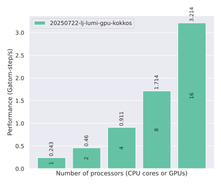
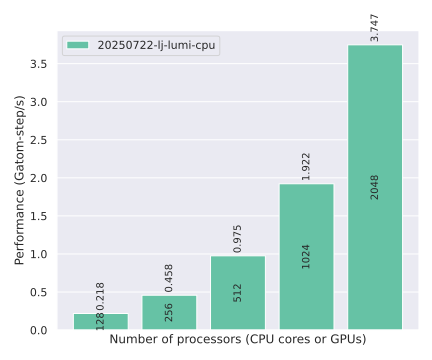

# LAMMPS

| Version   | Benchmark | System | GPU backend | GPU platform | Programming model | GPU FFT lib | Compiler     | Date       | Results                            |
|-----------|-----------|--------|-------------|--------------|-------------------|-------------|--------------|------------|------------------------------------|
| 22Jul2025 | LJ        | LUMI   | Kokkos      | ROCm 6.3.4   | Kokkos 4.6.2      | hipFFT      | Clang 18.0.0 | 2026-02-19 | [Link](#20250722-lj-lumi-gpu-kokkos)
| 22Jul2025 | LJ        | LUMI   | n/a         | n/a          | n/a               | n/a         | GNU 14.3.0   | 2026-02-20 | [Link](#20250722-lj-lumi-cpu)

## 20250722-LJ-LUMI-GPU-KOKKOS

| MPI ranks | Threads/rank | GCDs | Performance (Gatom-step/s) |
|-----------|--------------|------|----------------------------|
| 1         | 7            | 1    | 0.243                      |
| 2         | 7            | 2    | 0.460                      |
| 4         | 7            | 4    | 0.911                      |
| 8         | 7            | 8    | 1.714                      |
| 16        | 7            | 16   | 3.214                      |

## 20250722-LJ-LUMI-CPU

| MPI ranks | Threads/rank | GCDs | Performance (Gatom-step/s) |
|-----------|--------------|------|----------------------------|
| 128       | 1            | 0    | 0.218                      |
| 256       | 1            | 0    | 0.458                      |
| 512       | 1            | 0    | 0.975                      |
| 1024      | 1            | 0    | 1.922                      |
| 2048      | 1            | 0    | 3.747                      |

